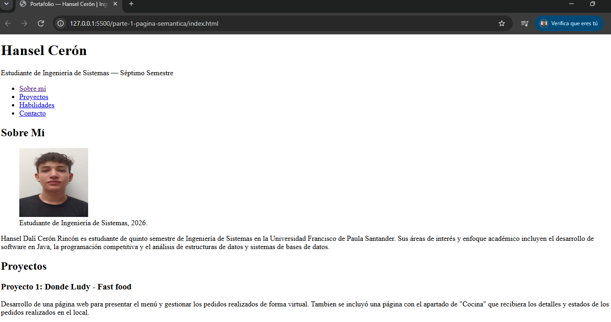
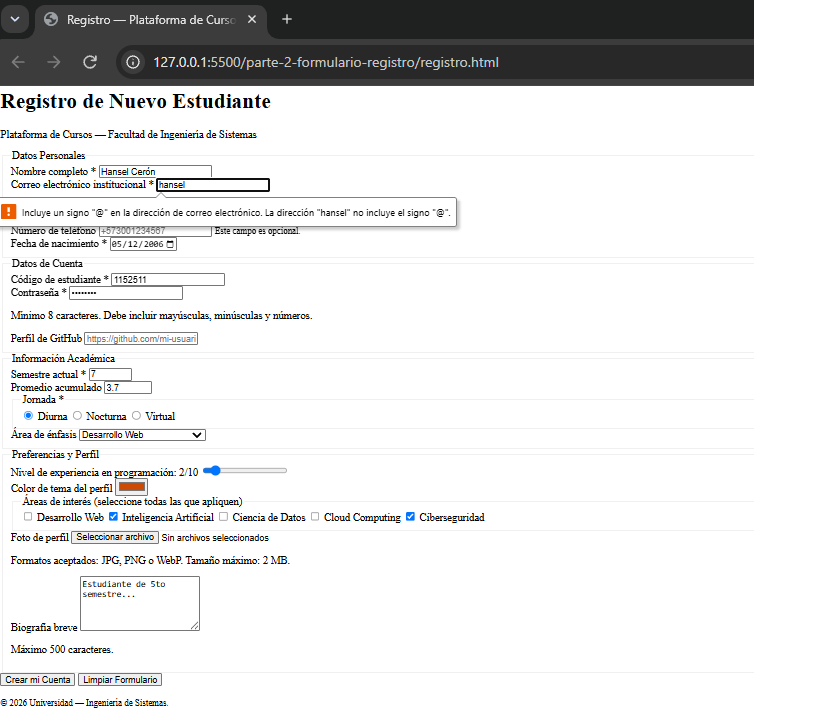

# Post-contenido — Unidad 2: HTML5 Básico

## Descripción
Repositorio del laboratorio de la Unidad 2 de Programación Web —
Séptimo Semestre. Contiene dos partes: página de portafolio con
etiquetas semánticas de HTML5 (parte-1-pagina-semantica/) y
formulario de registro con validación nativa HTML5
(parte-2-formulario-registro/).

## Parte 1 — Página semántica
Página de portafolio personal que implementa header, nav, main,
section, article, aside y footer, con listas ul/ol/dl, un bloque
de multimedia (video o audio) con su recurso de accesibilidad
asociado, una sección de preguntas frecuentes con details/summary,
y meta tags de SEO. Ver parte-1-pagina-semantica/.

## Parte 2 — Formulario de registro
Formulario de registro universitario con más de 10 tipos de
input HTML5 (text, email, password, tel, url, date, number,
range, color, file, checkbox, radio, hidden, textarea, select)
agrupados en fieldsets, con validación nativa y atributos ARIA.
Ver parte-2-formulario-registro/.

## Decisiones de diseño

### 1. Estructura semántica de "Logros y Certificaciones" (Parte 1)
Se decidió estructurar cada certificación utilizando elementos &lt;article&gt; independientes, porque son unidades de información completas y tienen sentido por si solas afuera del sitio. 
Esta decisión permite que el contenido sea redistribuible y fácil de reutilizar sin perder contexto.

### 2. Formato multimedia de la introducción personal (Parte 1)
Se optó por un elemento de audio con transcripción dentro de
&lt;details&gt;/&lt;summary&gt; con formatos MP3 y OGG, debido a que permite una carga más ligera y directa en el sitio web sin descuidar la accesibilidad. Esta estructura asegura que la información sea totalmente accesible para cualquier usuario, cumpliendo con los estándares de perceptibilidad.

### 3. Marcado del campo opcional "teléfono" (Parte 2)
Se tomó la decisión de utilizar la Opción B con aria-describedby para asociar el campo de teléfono con un texto de ayuda contextual, de esta forma se mantiene la consistencia con el patrón de accesibilidad y evitamos alterar el texto visible del label.

## Cómo visualizar el proyecto
1. Clonar el repositorio: `git clone [URL-del-repo]`
2. Abrir la carpeta en Visual Studio Code
3. Clic derecho en index.html o registro.html → "Open with Live Server"

## Capturas de pantalla

